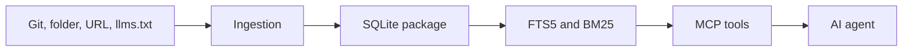

# Architecture

DocsContext separates expensive ingestion from the fast retrieval path.

## Build phase

The ingestion layer detects the source, loads supported documents, extracts sections, estimates tokens, computes fingerprints, and creates a `BuildResult`.

The storage layer persists manifests, source metadata, documents, chunks, warnings, and an FTS5 search table in one portable `.db` file.

## Query phase

The MCP server opens the selected package, builds an FTS query, ranks matches with BM25, applies a relative relevance cutoff, and trims results to the requested token budget.

Queries do not fetch the internet. Registry access is only needed when discovering or downloading a package.

## Why SQLite

Library documentation is curated, structured, and queried with concrete API names. Full-text search gives inspectable exact-term matching without embedding generation, vector infrastructure, or a remote query dependency.
