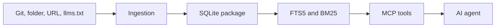

# Architecture

GroundKit separates expensive ingestion from the fast retrieval path.

## Project boundaries

The solution is organized around dependency direction rather than one project per
technical noun:

```text
src/
├── GroundKit.Abstractions/       # Shared records, options, and service interfaces
├── GroundKit.Core/               # Ingestion, source detection, package workflows
├── GroundKit.Storage.Sqlite/     # SQLite persistence, FTS5, and BM25 retrieval
├── GroundKit.Hosting/            # DI composition for executable hosts
├── GroundKit.Cli/                # User-facing command-line tool
├── GroundKit.Mcp/                # MCP stdio and HTTP adapter
├── GroundKit.Registry/            # Registry maintenance tool and HTTP server
└── GroundKit.ServiceDefaults/    # Host telemetry, health checks, and resilience
```

The dependency direction is:

```text
GroundKit.Abstractions <- GroundKit.Core
GroundKit.Abstractions <- GroundKit.Storage.Sqlite
GroundKit.Core + GroundKit.Storage.Sqlite <- GroundKit.Hosting
GroundKit.Hosting <- CLI, MCP, and Registry hosts
```

`GroundKit.Abstractions` has no SQLite, EF Core, MCP, or CLI dependency. SQLite
entities remain internal to `GroundKit.Storage.Sqlite`; they are not a public
schema package. MCP payloads remain MCP adapter contracts rather than leaking
into the core domain.

Tests follow the same ownership boundaries: `GroundKit.Core.Tests`,
`GroundKit.Storage.Sqlite.Tests`, `GroundKit.Cli.Tests`,
`GroundKit.Mcp.Tests`, and `GroundKit.Registry.Tests`.

Protocol, client, SDK, and server packages are intentionally deferred. They
should be introduced only when an API has independent consumers, release
versioning, or a deployment lifecycle separate from the current host.



## Build phase

The ingestion layer detects the source, loads supported documents, extracts sections, estimates tokens, computes fingerprints, and creates a `BuildResult`.

The storage layer persists manifests, source metadata, documents, chunks, warnings, and an FTS5 search table in one portable `.db` file.

## Query phase

The MCP server opens the selected package, builds an FTS query, ranks matches with BM25, applies a relative relevance cutoff, and trims results to the requested token budget.

Queries do not fetch the internet. Registry access is only needed when discovering or downloading a package.

The result includes package identity and version, selected document and section titles, content, token estimates, code presence, and relevance scores. This makes retrieved evidence inspectable by both an MCP client and a human reviewing an agent response.

## Data boundaries

GroundKit is a static documentation grounding layer. It is appropriate for versioned API references, guides, runbooks, and other documents that can be packaged. It is not a source of live operational truth: prices, inventory, feature flags, and service status belong behind a current API or database query.

## Why SQLite

Library documentation is curated, structured, and queried with concrete API names. Full-text search gives inspectable exact-term matching without embedding generation, vector infrastructure, or a remote query dependency. A vector index can be added for a corpus with large scale, weak vocabulary overlap, or unstructured content, but it is not required by this documentation use case.
