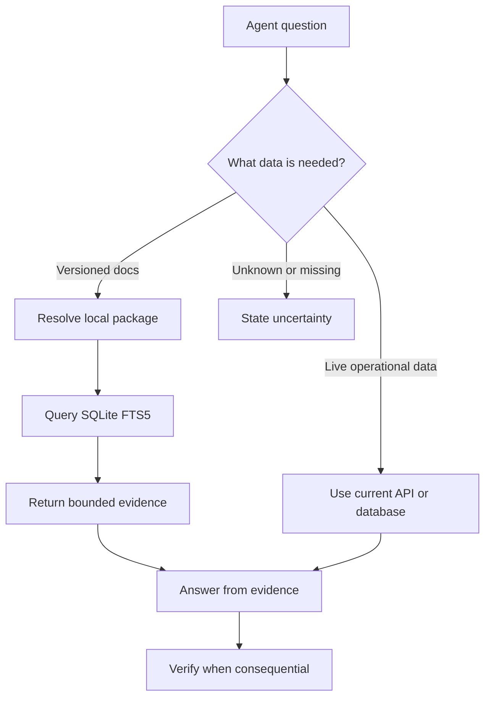

# Grounding model

Grounding connects an agent to external facts at response time. GroundKit grounds agents in versioned technical documentation stored in local SQLite packages.

Retrieval is evidence, not an instruction to fabricate an answer. The host agent must use returned sections, preserve uncertainty, and verify consequential decisions against the source.

## Grounding pipeline

1. Classify the request. Documentation questions need a package; live prices, status, and inventory need a current API or database; broad general knowledge may not need retrieval.
2. Identify the library and exact version needed from the project or user request.
3. Resolve an installed package with `resolve-source` or `library_catalog`.
4. If it is missing, use `search_packages`, select an exact version, and install it with `download_package`.
5. Retrieve focused sections with `query-docs` or its `get_docs` compatibility alias.
6. Use the structured hits and readable text as evidence for the response.
7. When the decision matters, compare the answer with the returned source metadata and relevant sections before acting.

## Why full-text search is the default

Documentation is usually curated, structured, and full of exact identifiers such as method names, options, and error codes. SQLite FTS5 with BM25 keeps those terms inspectable and avoids embedding generation, vector infrastructure, and a remote query dependency.

Vector search is still useful for large, heterogeneous, or poorly structured corpora, semantic-gap queries, and multimodal search. Choose it when those retrieval problems exist, not as a requirement for documentation grounding.

## Precision rules

- Prefer the package whose version matches the project dependency.
- Query with short API names, symbols, error codes, and concrete keywords.
- Keep `maxTokens` and `maxHits` bounded so evidence stays focused.
- Use `relativeScoreCutoff` to reject weakly related sections.
- Treat empty or weak results as missing evidence. Resolve the package, version, or query before answering from memory.
- Use package inspection when source location, fingerprint, build time, or freshness matters.
- Keep live and static facts separate. A locally indexed page cannot prove a current price or service status.

## Reading query results

Each result identifies the package and version, then returns document and section titles, content, token estimates, code presence, and a relevance score. Structured MCP content is available to clients that support it; concise text is available to clients that consume tool output as prose.

The score ranks results inside the query. It is not a truth probability. A high score does not replace checking the version, source, or surrounding section.

## What GroundKit does not do

GroundKit does not browse the internet during local queries, guarantee that a source is current, or verify every generated answer. Registry access is used for discovery and package download. The host agent remains responsible for selecting evidence, explaining conflicts, and citing or linking sources when the workflow requires it.
